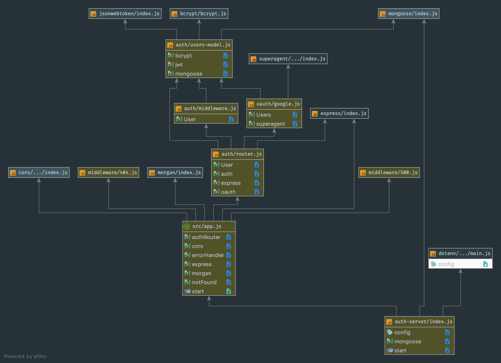

# LAB - 09

 ## API Server

 ### Author: Evan Brecht-Curry

 ### Links and Resources
* [submission PR](https://github.com/evan-401-advanced-javascript/lab-13/pull/1)
* [travis](https://www.travis-ci.com/evan-401-advanced-javascript/lab-13/builds/125003436)
* [front-end](https://lab11-auth-server.herokuapp.com/) 
* [docs](http://localhost:3000/docs/)

 ##### Exported Values and Methods

 ###### 
`get(books/:id) -> {object} 200 -  book title`
`post(books) -> {object} 200 -  count and book results

`get(signup) -> {object} 200 - request token`
`get(signin) -> {object} 200 - request token`

g### Setup
#### `.env` requirements
* `PORT` - 3003

 #### UML
